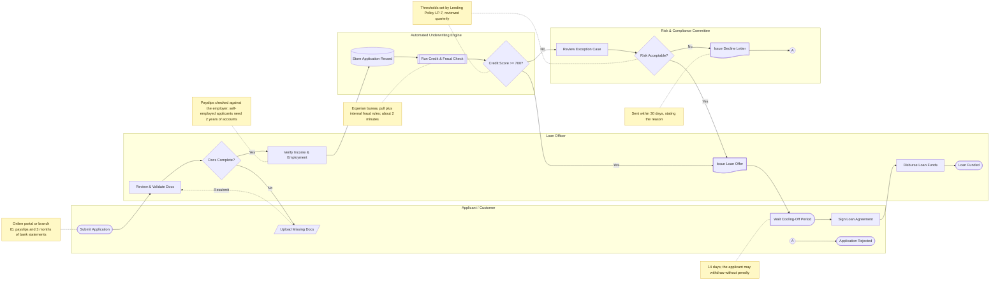

# Customer Loan Application Process

```mermaid
flowchart LR
  subgraph lane-customer["Applicant / Customer"]
    direction LR
    n_submit_application(["Submit Application"])
    n_upload_missing_docs[/"Upload Missing Docs"/]
    n_wait_cooling_off_period@{ shape: delay, label: "Wait Cooling-Off Period" }
    n_sign_loan_agreement["Sign Loan Agreement"]
    c_a_out(("A"))
    n_application_rejected(["Application Rejected"])
  end
  subgraph lane-officer["Loan Officer"]
    direction LR
    n_review_validate_docs["Review & Validate Docs"]
    n_docs_complete{"Docs Complete?"}
    n_verify_income_employment["Verify Income & Employment"]
    n_issue_loan_offer@{ shape: doc, label: "Issue Loan Offer" }
    n_disburse_loan_funds["Disburse Loan Funds"]
    n_loan_funded(["Loan Funded"])
  end
  subgraph lane-engine["Automated Underwriting Engine"]
    direction LR
    n_store_application_record[("Store Application Record")]
    n_run_credit_fraud_check[["Run Credit & Fraud Check"]]
    n_credit_score_700{"Credit Score >= 700?"}
  end
  subgraph lane-risk["Risk & Compliance Committee"]
    direction LR
    n_review_exception_case["Review Exception Case"]
    n_risk_acceptable{"Risk Acceptable?"}
    n_issue_decline_letter@{ shape: doc, label: "Issue Decline Letter" }
    c_a_in(("A"))
  end
  n_submit_application --> n_review_validate_docs
  n_review_validate_docs --> n_docs_complete
  n_docs_complete -->|"No"| n_upload_missing_docs
  n_upload_missing_docs -.->|"Resubmit"| n_review_validate_docs
  n_docs_complete -->|"Yes"| n_verify_income_employment
  n_verify_income_employment --> n_store_application_record
  n_store_application_record --> n_run_credit_fraud_check
  n_run_credit_fraud_check --> n_credit_score_700
  n_credit_score_700 -->|"Yes"| n_issue_loan_offer
  n_credit_score_700 -->|"No"| n_review_exception_case
  n_review_exception_case --> n_risk_acceptable
  n_risk_acceptable -->|"Yes"| n_issue_loan_offer
  n_issue_loan_offer --> n_wait_cooling_off_period
  n_wait_cooling_off_period --> n_sign_loan_agreement
  n_sign_loan_agreement --> n_disburse_loan_funds
  n_disburse_loan_funds --> n_loan_funded
  n_risk_acceptable -->|"No"| n_issue_decline_letter
  n_issue_decline_letter --> c_a_in
  c_a_out --> n_application_rejected
  note_1["Online portal or branch<br>ID, payslips and 3 months of bank statements"]:::note
  note_1 -.- n_submit_application
  note_2["Experian bureau pull plus internal fraud rules; about 2 minutes"]:::note
  note_2 -.- n_run_credit_fraud_check
  note_3["Thresholds set by Lending Policy LP-7, reviewed quarterly"]:::note
  note_3 -.- n_credit_score_700
  note_3 -.- n_risk_acceptable
  note_4["Sent within 30 days, stating the reason"]:::note
  note_4 -.- n_issue_decline_letter
  note_5["14 days; the applicant may withdraw without penalty"]:::note
  note_5 -.- n_wait_cooling_off_period
  note_6["Payslips checked against the employer; self-employed applicants need 2 years of accounts"]:::note
  note_6 -.- n_verify_income_employment
  classDef note fill:#fff8c5,stroke:#d4a72c,color:#3b2e00
```
