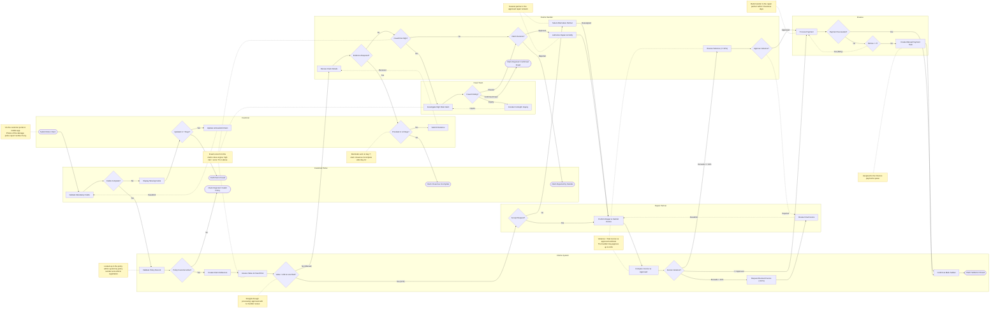

# Motor Insurance Claim Processing

```mermaid
flowchart LR
  subgraph lane-customer["Customer"]
    direction LR
    n_start(["Submit Motor Claim"])
    n_c_upd_dec{"Updated in 7 Days?"}
    n_c_upd["Update & Resubmit Claim"]
    n_c_ev_dec{"Provided in 14 Days?"}
    n_c_sub_ev["Submit Evidence"]
  end
  subgraph lane-portal["Customer Portal"]
    direction LR
    n_p_val["Validate Mandatory Fields"]
    n_p_dec{"Fields Complete?"}
    n_p_miss["Display Missing Fields"]
    n_p_close(["Draft Claim Closed"])
    n_p_rej_pol(["Claim Rejected: Invalid Policy"])
    n_p_close_inc(["Claim Closed as Incomplete"])
    n_p_rej_hand(["Claim Rejected by Handler"])
  end
  subgraph lane-system["Claims System"]
    direction LR
    n_s_val["Validate Policy Record"]
    n_s_pol_dec{"Policy Found & Active?"}
    n_s_ref["Create Claim Reference"]
    n_s_checks["Assess Value & Fraud Risk"]
    n_s_stp_dec{"Value < £5k & Low Risk?"}
    n_s_inv_cmp["Compare Invoice vs Approved"]
    n_s_inv_dec{"Invoice Variance?"}
    n_s_req_rev["Request Revised Invoice (>10%)"]
    n_s_settle["Confirm & Mark Settled"]
    n_s_settled(["Claim Settled & Closed"])
  end
  subgraph lane-handler["Claims Handler"]
    direction LR
    n_h_rev["Review Claim Details"]
    n_h_ev_dec{"Evidence Required?"}
    n_h_reassign["Select Alternative Partner"]
    n_h_fr_dec{"Fraud Risk High?"}
    n_h_dec{"Claim Decision?"}
    n_h_rej_fraud(["Claim Rejected: Confirmed Fraud"])
    n_h_auth["Authorize Repair & Notify"]
    n_h_inv_rev["Review Variance (<=10%)"]
    n_h_inv_dec{"Approve Variance?"}
  end
  subgraph lane-fraud["Fraud Team"]
    direction LR
    n_f_inv["Investigate High Risk Claim"]
    n_f_dec{"Fraud Finding?"}
    n_f_further["Conduct In-Depth Inquiry"]
  end
  subgraph lane-repair["Repair Partner"]
    direction LR
    n_r_acc_dec{"Accept Request?"}
    n_r_repair["Perform Repair & Submit Invoice"]
    n_r_rev["Revise Final Invoice"]
  end
  subgraph lane-finance["Finance"]
    direction LR
    n_fn_pay["Process Payment"]
    n_fn_dec{"Payment Succeeded?"}
    n_fn_retry_dec{"Retries < 2?"}
    n_fn_manual["Create Manual Payment Task"]
  end
  n_start --> n_p_val
  n_p_val --> n_p_dec
  n_p_dec -->|"No"| n_p_miss
  n_p_miss --> n_c_upd_dec
  n_c_upd_dec -->|"Yes"| n_c_upd
  n_c_upd -.->|"Resubmit"| n_p_val
  n_c_upd_dec -->|"No"| n_p_close
  n_p_dec -->|"Yes"| n_s_val
  n_s_val --> n_s_pol_dec
  n_s_pol_dec -->|"No"| n_p_rej_pol
  n_s_pol_dec -->|"Yes"| n_s_ref
  n_s_ref --> n_s_checks
  n_s_checks --> n_s_stp_dec
  n_s_stp_dec -->|"Yes (STP)"| n_r_acc_dec
  n_r_acc_dec -->|"Yes"| n_r_repair
  n_r_acc_dec -->|"No"| n_h_reassign
  n_h_reassign -->|"Reassigned"| n_r_repair
  n_s_stp_dec -->|"No (Manual)"| n_h_rev
  n_h_rev --> n_h_ev_dec
  n_h_ev_dec -->|"Yes"| n_c_ev_dec
  n_c_ev_dec -->|"Yes"| n_c_sub_ev
  n_c_sub_ev -.->|"Received"| n_h_rev
  n_c_ev_dec -->|"No"| n_p_close_inc
  n_h_ev_dec -->|"No"| n_h_fr_dec
  n_h_fr_dec -->|"Yes"| n_f_inv
  n_f_inv --> n_f_dec
  n_f_dec -->|"Inquiry"| n_f_further
  n_f_further -.->|"Inquire"| n_f_inv
  n_f_dec -->|"Confirmed Fraud"| n_h_rej_fraud
  n_f_dec -->|"Cleared"| n_h_dec
  n_h_fr_dec -->|"No"| n_h_dec
  n_h_dec -->|"Rejected"| n_p_rej_hand
  n_h_dec -->|"Approved"| n_h_auth
  n_h_auth --> n_r_repair
  n_r_repair --> n_s_inv_cmp
  n_s_inv_cmp --> n_s_inv_dec
  n_s_inv_dec -->|"<= Approved"| n_fn_pay
  n_s_inv_dec -->|"Exceeds > 10%"| n_s_req_rev
  n_s_req_rev --> n_r_rev
  n_r_rev -.->|"Resubmit"| n_r_repair
  n_s_inv_dec -->|"Exceeds <= 10%"| n_h_inv_rev
  n_h_inv_rev --> n_h_inv_dec
  n_h_inv_dec -->|"Approved"| n_fn_pay
  n_h_inv_dec -.->|"Rejected"| n_r_rev
  n_fn_pay --> n_fn_dec
  n_fn_dec -->|"Yes"| n_s_settle
  n_fn_dec -->|"No"| n_fn_retry_dec
  n_fn_retry_dec -.->|"Yes (Retry)"| n_fn_pay
  n_fn_retry_dec -->|"No"| n_fn_manual
  n_fn_manual --> n_s_settle
  n_s_settle --> n_s_settled
  note_1["Via the customer portal or mobile app<br>Photos of the damage; police report number if any"]:::note
  note_1 -.- n_start
  note_2["Reminder sent on day 7; claim closed as incomplete after day 14"]:::note
  note_2 -.- n_c_ev_dec
  note_3["Looked up in the policy admin system by policy number and vehicle registration"]:::note
  note_3 -.- n_s_val
  note_4["Fraud score from the claims rules engine; high risk = score 70 or above"]:::note
  note_4 -.- n_s_checks
  note_4 -.- n_h_fr_dec
  note_4 -.- n_f_inv
  note_5["Straight-through processing: approved with no handler review"]:::note
  note_5 -.- n_s_stp_dec
  note_6["Nearest partner in the approved repair network"]:::note
  note_6 -.- n_h_auth
  note_6 -.- n_h_reassign
  note_7["Variance = final invoice vs approved estimate<br>The handler may approve up to 10%"]:::note
  note_7 -.- n_s_inv_cmp
  note_7 -.- n_h_inv_rev
  note_8["Bank transfer to the repair partner within 5 business days"]:::note
  note_8 -.- n_fn_pay
  note_9["Assigned to the Finance payments queue"]:::note
  note_9 -.- n_fn_manual
  classDef note fill:#fff8c5,stroke:#d4a72c,color:#3b2e00
```
